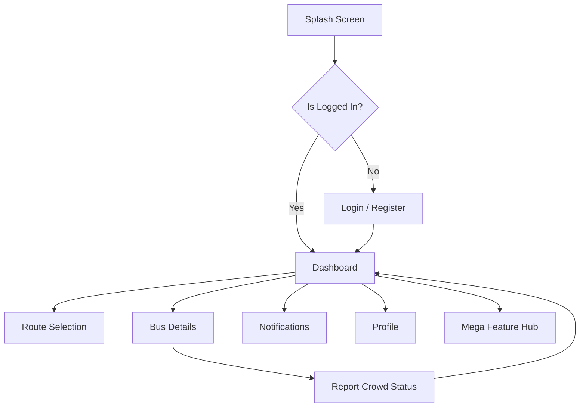

# Vidyarthi-Bus 🚌

**Vidyarthi-Bus** is a real-time crowdsourced bus crowd monitoring application designed specifically for college students in rural and remote areas. It empowers students to make informed decisions about their commute by providing live data on bus occupancy.

---

## 📱 App Screenshots

<p align="center">
  
  
  
  
  
  
  
  
  
  
  
  
  
  
  
  
</p>

---

## 🚀 Features

- **Real-time Crowd Meter**: Instantly view the current occupancy level (Empty, Seats Available, or Full) of any college bus.
- **3D Digital Bus Pass**: Personalized interactive pass for students (e.g., Keerthana G K).
- **Mega Hub (50+ Services)**: Interconnected student services including Safety, Wallet, Attendance, and more.
- **Advanced Search**: Intelligent filtering by City, State, Country, and Route.
- **Live Real-time Tracking**: Monitor bus location, speed, and estimated arrival times.
- **Modern UI/UX**: Built with Material 3, Glassmorphism effects, and hardware-accelerated 3D animations.

---

## 🛠 Tech Stack

- **Language**: [Kotlin](https://kotlinlang.org/)
- **UI Framework**: [Jetpack Compose](https://developer.android.com/jetpack/compose) (Material 3)
- **Architecture**: MVVM + Clean Architecture
- **Dependency Injection**: [Hilt](https://developer.android.com/training/dependency-injection/hilt-android)
- **Backend**: [Firebase](https://firebase.google.com/)
  - Authentication
  - Realtime Database
  - Cloud Messaging (FCM)
- **Concurrency**: Coroutines & StateFlow
- **Image Loading**: [Coil](https://coil-kt.github.io/coil/)

---

## 📊 Application Flow



---

## 👥 Credits

This project was created with ❤️ by **Sachin and team**.

---

## 🏗 Installation & Setup

1. **Clone the repository**:
   ```bash
   git clone https://github.com/01Sachinc/android_app.git
   ```
2. **Open in Android Studio**:
   Import the project and let Gradle sync.
3. **Screenshots**:
   To see images in the README, create a `screenshots/` folder in the root directory and add your captured app images as `dashboard.png`, `pass.png`, `tracking.png`, and `premium.png`.
4. **Firebase Configuration**:
   - Create a Firebase project and add your `google-services.json` to the `app/` directory.
   - Enable Email/Password Authentication.
   - Set up Realtime Database.

---
*Developed to bridge the communication gap for students in remote areas.*
