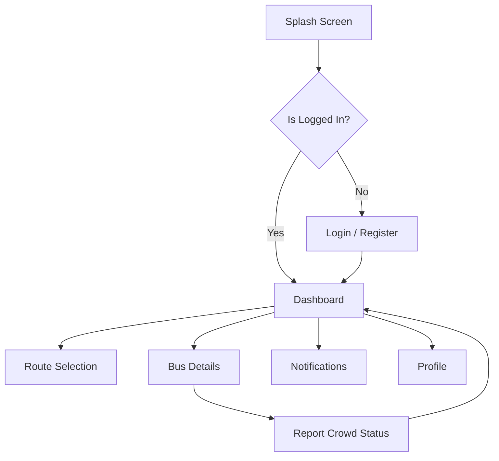

# Vidyarthi-Bus 🚌

**Vidyarthi-Bus** is a real-time crowdsourced bus crowd monitoring application designed specifically for college students in rural and remote areas. It empowers students to make informed decisions about their commute by providing live data on bus occupancy.

---

## 🚀 Features

- **Real-time Crowd Meter**: Instantly view the current occupancy level (Empty, Seats Available, or Full) of any college bus.
- **Crowdsourced Reporting**: Encourages students already on board to report the current status, ensuring the data is fresh and accurate.
- **Route Management**: Easily select and save your preferred routes for quick access.
- **Smart Notifications**: Receive alerts for bus delays, cancellations, or when a bus is reaching full capacity.
- **Alternative Transport**: Integrated shared auto contacts for those times when the bus is too full or delayed.
- **Modern UI/UX**: Built with Material 3 and Jetpack Compose for a smooth, responsive, and dark-mode-ready experience.

---

## 🛠 Tech Stack

- **Language**: [Kotlin](https://kotlinlang.org/)
- **UI Framework**: [Jetpack Compose](https://developer.android.com/jetpack/compose) (Material 3)
- **Architecture**: MVVM + Clean Architecture
- **Dependency Injection**: [Hilt](https://developer.android.com/training/dependency-injection/hilt-android)
- **Backend**: [Firebase](https://firebase.google.com/)
  - Authentication
  - Realtime Database
  - Cloud Messaging (FCM)
- **Concurrency**: Coroutines & StateFlow
- **Maps & Location**: Google Maps SDK & FusedLocationProviderClient

---

## 📊 Application Flow



---

## 👥 Credits

This project was created with ❤️ by **Sachin and team**.

---

## 🏗 Installation & Setup

1. **Clone the repository**:
   ```bash
   git clone https://github.com/01Sachinc/android_app.git
   ```
2. **Open in Android Studio**:
   Import the project and let Gradle sync.
3. **Firebase Configuration**:
   - Create a Firebase project and add your `google-services.json` to the `app/` directory.
   - Enable Email/Password Authentication.
   - Set up Realtime Database with the rules provided in the documentation.
4. **Google Maps**:
   - Add your Google Maps API Key in `AndroidManifest.xml`.

---
*Developed to bridge the communication gap for students in remote areas.*
